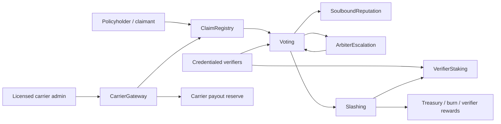

# Veristake Contracts

Veristake is an on-chain verification protocol layer for licensed insurance carriers. Carriers keep underwriting authority, premium pricing, regulatory compliance, and policyholder liability. These contracts provide claim metadata registration, verifier staking, commit-reveal voting, challenge escalation, slashing, reputation, and carrier-funded payout escrow.

Whitepaper artifacts are available in `docs/whitepaper/`.

## Architecture



## Parameters

| Parameter | Min | Default | Max | Contract |
| --- | ---: | ---: | ---: | --- |
| Commit window | 5 minutes | 24 hours | 14 days | Voting |
| Reveal window | 5 minutes | 24 hours | 14 days | Voting |
| Challenge window | 5 minutes | 48 hours | 14 days | Voting |
| Claim bond | 1 VST | 100 VST | 1,000,000 VST | Voting |
| Max appeals | 1 | 3 | 5 | ArbiterEscalation |
| Disagreement tolerance | 0% | 20% | 50% | Slashing |
| Supermajority threshold | 50.01% | 75% | 100% | Slashing |
| Slash rate | 0% | 50% | 100% | Slashing |
| Slashed pool split | Must sum to 100% | 60/30/10 | Must sum to 100% | Slashing |
| Reputation EMA window | 10 claims | 100 claims | 365 claims | SoulboundReputation |
| New verifier prior | 50% | 70% | 90% | SoulboundReputation |
| Voting weight bounds | 0.5x | 0.5x..1.0x | 1.0x | SoulboundReputation |
| VST cap | immutable | 1,000,000,000 VST | immutable | VST |

## Carrier Integration Quickstart

1. `registerCarrier(carrierAdmin, carrierLicenseHash)`
2. `registerPolicy(policyId, domainId, coverageLimit, payoutToken)`
3. `fundPayoutReserve(policyId, amount)`
4. Claimants submit claims to `ClaimRegistry.submitClaim(domainId, ipfsMetadataHash, requestedPayoutAmount, policyId)`

When a claim reaches `FinalResolved` with `Approve` or `Partial`, anyone can call `CarrierGateway.releasePayout(claimId)` to transfer the approved amount from the carrier-funded reserve to the claimant.

## Local Commands

Install dependencies with `npm install`, then run:

```powershell
forge test --fuzz-runs 10000
forge build
forge coverage --summary --skip script --exclude-tests --no-match-coverage "lib/.*|test/.*"
```

## Base Sepolia Deployment

```powershell
$env:BASE_SEPOLIA_RPC_URL="https://..."
forge script script/Deploy.s.sol:Deploy --rpc-url $env:BASE_SEPOLIA_RPC_URL --private-key 0x... --broadcast --verify
```

The deploy script creates a two-day `TimelockController`, deploys the full system, wires contract-to-contract roles, then hands administration to the timelock. In this first script, the broadcaster is also the initial treasury; update `treasury` in `Deploy.s.sol` before production deployment if treasury should be separate.

## Demo deployment (Tenderly Virtual TestNet)

```powershell
$env:TENDERLY_VIRTUAL_RPC_URL="https://virtual.base-sepolia.rpc.tenderly.co/..."; $env:DEPLOYER_PRIVATE_KEY="0x..."; $env:DEMO_BACKEND_KEY="0x..."; $env:DEMO_VST_FAUCET_WALLET="0x..."; forge script script/DeployDemo.s.sol:DeployDemo --rpc-url $env:TENDERLY_VIRTUAL_RPC_URL --private-key $env:DEPLOYER_PRIVATE_KEY --broadcast
```

`DeployDemo.s.sol` deploys the same system on the active RPC, grants `Voting.PARAMETER_ROLE` to the backend signer derived from `DEMO_BACKEND_KEY`, sets all voting windows to the contract minimum of five minutes, mints demo-only VST to `DEMO_VST_FAUCET_WALLET`, and prints JSON that can be copied into `NEXT_PUBLIC_VERISTAKE_DEMO_DEPLOYMENT_ADDRESSES_JSON`.
