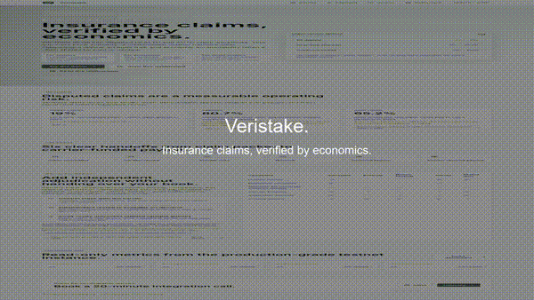

# Sales Talk Track

## claimant-health-er-appeal.mp4

Burned-in captions:

- A denied ER visit becomes a structured appeal packet.
- The claimant submits without installing a wallet.
- Verifier review opens in the demo sandbox.
- Votes stream in with reputation context.
- The pool approves the appeal 4-1.
- Carrier reserve releases the payout.

Spoken talk-track:

"Here is the claimant experience. The member had chest pain, an ER workup confirmed unstable angina, and the plan denied the visit as not medically necessary. Veristake turns the appeal into a structured packet, so reviewers are not hunting through PDFs. The claimant does not install a wallet or touch testnet funds. In the background, a sandbox wallet is funded, the claim is submitted, and seeded verifiers commit and reveal their decisions. In this scenario the verifier pool approves 4-1, the dissent is not punished because it is within tolerance, and the carrier reserve releases the approved payout."

Likely objections:

- "We cannot expose PHI to random reviewers." Counter: "The demo uses mock packets; production would use privacy-aware packet access, professional credentialing, and carrier-approved evidence scopes."
- "Our adjusters already do this." Counter: "Veristake is an escalation and audit layer, not a replacement for your adjusters."
- "What if verifiers disagree?" Counter: "Disagreement is expected; penalties only fire on strong consensus plus arbiter validation."

## carrier-pacific-mutual.mp4

Burned-in captions:

- Pacific Mutual starts from carrier onboarding.
- The auto-collision policy is registered.
- A $10k reserve is funded in the sandbox.
- Three claims resolve from the carrier reserve.
- Manual adjudication compresses from weeks to minutes.

Spoken talk-track:

"Now this is the carrier view. Pacific Mutual registers as a carrier, creates an auto-collision policy, and funds a dedicated payout reserve. The reserve matters: Veristake never takes balance-sheet risk and never pretends to be the insurer. Once the reserve exists, claims can flow through the verification layer with an auditable trail. This demo auto-plays three claim outcomes so an executive can see the operational picture: open claims, reserve movement, payout status, and time-to-resolution."

Likely objections:

- "We cannot let an outside network control claims." Counter: "The carrier keeps underwriting authority, policy rules, pricing, and reserve ownership."
- "This sounds like a new claims core." Counter: "It plugs into the disputed-claim queue and produces auditable decisions."
- "What happens if reserves are insufficient?" Counter: "Payout release fails safely and exposes reserve health before money moves."

## verifier-three-claims-one-fraud.mp4

Burned-in captions:

- A medical-billing reviewer joins the HEALTH pool.
- Three claims arrive: routine, emergency, and fraud.
- The reviewer votes on the evidence.
- The duplicate-billing fraud pattern is caught.
- Rewards, accuracy, and reputation update instantly.

Spoken talk-track:

"This is the verifier side. A credentialed reviewer joins the HEALTH pool and reviews three claims: a routine physical, the ER denial appeal, and a duplicate-billed physical-therapy pattern. The reviewer commits and reveals decisions, and the system measures accuracy after resolution. The important moment is the fraud case. If a verifier approves a claim that the supermajority and arbiter panel rule fraudulent, their bond is slashed and redistributed to correct reviewers. Grey-area disagreements are treated differently, so the mechanism can punish careless or malicious review without chilling honest judgment."

Likely objections:

- "Reviewers will game the majority." Counter: "Commit-reveal hides votes during the commit phase, and reputation changes the economics over time."
- "Slashing sounds hostile." Counter: "For carriers, it means reviewers have real downside for rubber-stamping bad claims."
- "How do we know reviewers are qualified?" Counter: "Domain pools are credentialed; the current demo uses mocks, while production credentialing is an integration decision."

## highlight-reel-90s.mp4

Burned-in captions:

- Veristake. Insurance claims, verified by economics.
- Claimant: denied ER appeal to payout.
- Carrier: onboarding, reserve, live payouts.
- Verifier: fraud caught, incentives enforced.
- veristake.xyz/demo.

Spoken talk-track:

"This ninety-second reel shows the whole Veristake story. A claimant can submit a disputed claim without crypto setup. A carrier can integrate a reserve-backed verification layer without giving up its book. A credentialed verifier network can catch legitimate appeals and fraud with economics behind every decision. The demo uses a sandbox for speed, while the dashboard reads the production-grade Base Sepolia deployment. That split gives us both a reliable sales demo and a clean testnet system for audit-grade activity."

Likely objections:

- "Is this live or staged?" Counter: "The demo flow is deterministic on a sandbox; the dashboard is read-only from the production-grade testnet deployment."
- "Why not just use arbitration vendors?" Counter: "Veristake adds cross-carrier liquidity, programmable incentives, and a verifiable audit trail."
- "Is this for every claim?" Counter: "No. The first wedge is disputed and high-friction claims in HEALTH and AUTO."

## Cold Email Template

Subject: 90-second demo: disputed claims with economic verification

Hi {{first_name}}, Veristake is a verification layer for disputed insurance claims. Your adjusters keep adjusting, your carrier keeps the reserve, and a credentialed verifier pool adds independent review with economic accountability. The first demo focuses only on HEALTH and AUTO claim workflows.

I recorded a 90-second silent walkthrough below. If this maps to your disputed-claim queue, I would like to show the live three-minute version and discuss where it could sit beside your current claims pipeline.

Calendly: {{calendly_url}}

## LinkedIn Carousel Script

Slide 1: Insurance claims, verified by economics.

Slide 2: Disputed claims are expensive because the decision path is opaque.

Slide 3: Veristake does not replace adjusters. It adds an escalation layer.

Slide 4: Claimants submit structured packets, not messy email chains.

Slide 5: Carriers fund reserves and keep underwriting authority.

Slide 6: Credentialed reviewers vote with reputation and downside.

Slide 7: Grey-area disagreement is tolerated. Fraud is not.

Slide 8: HEALTH demo: ER denial appeal resolves to payout.

Slide 9: AUTO demo: Pacific Mutual watches reserve-backed payouts.

Slide 10: Try the demo or book a 20-minute integration call.
